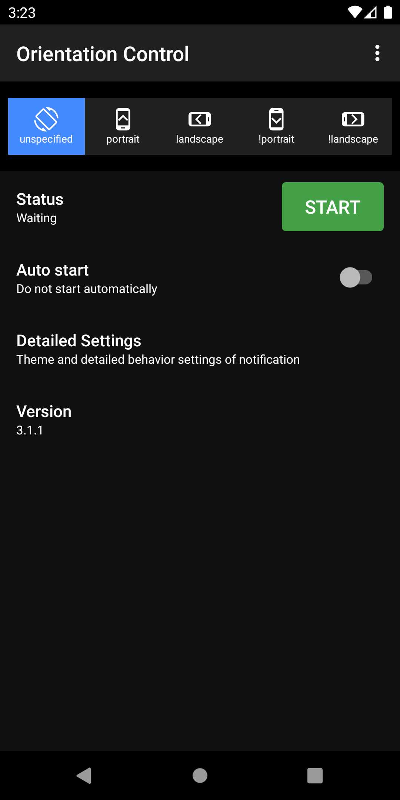
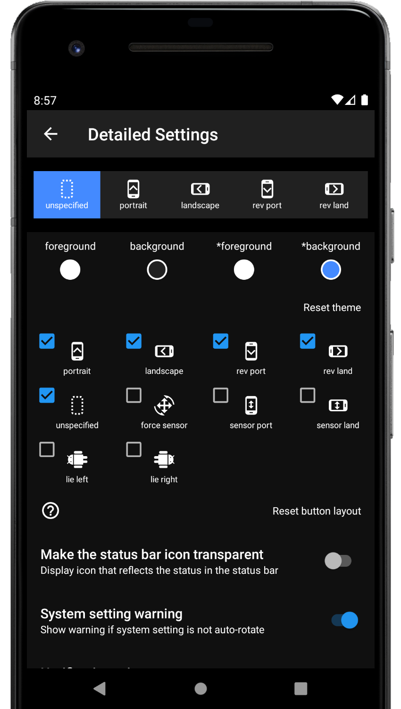
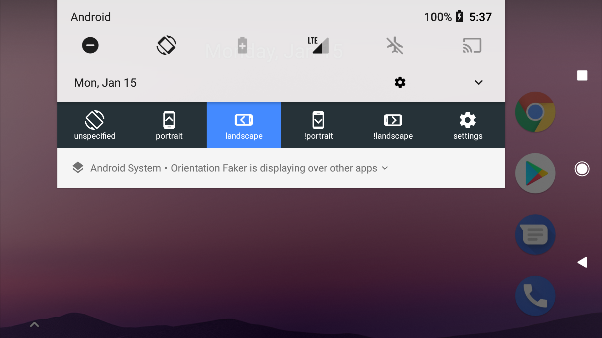
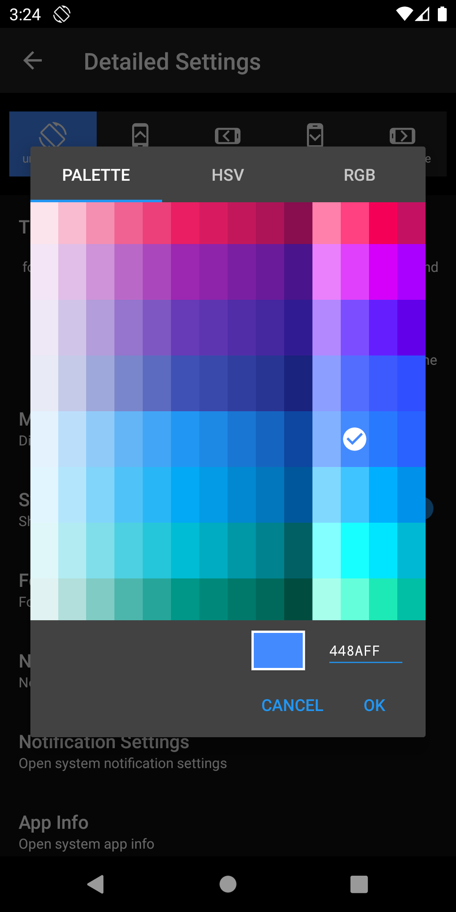
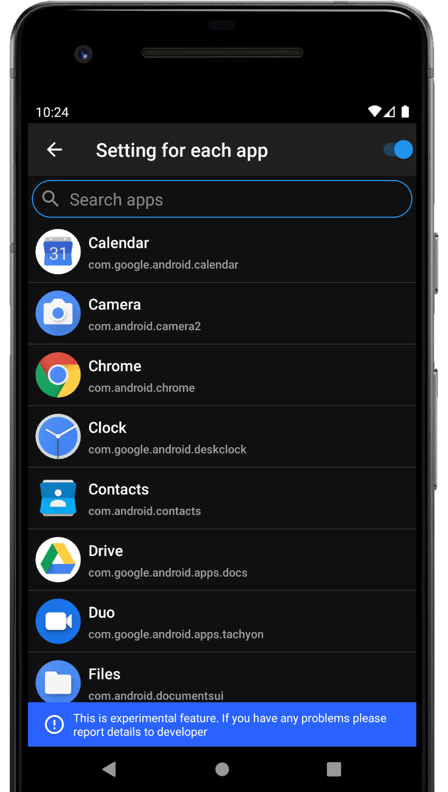
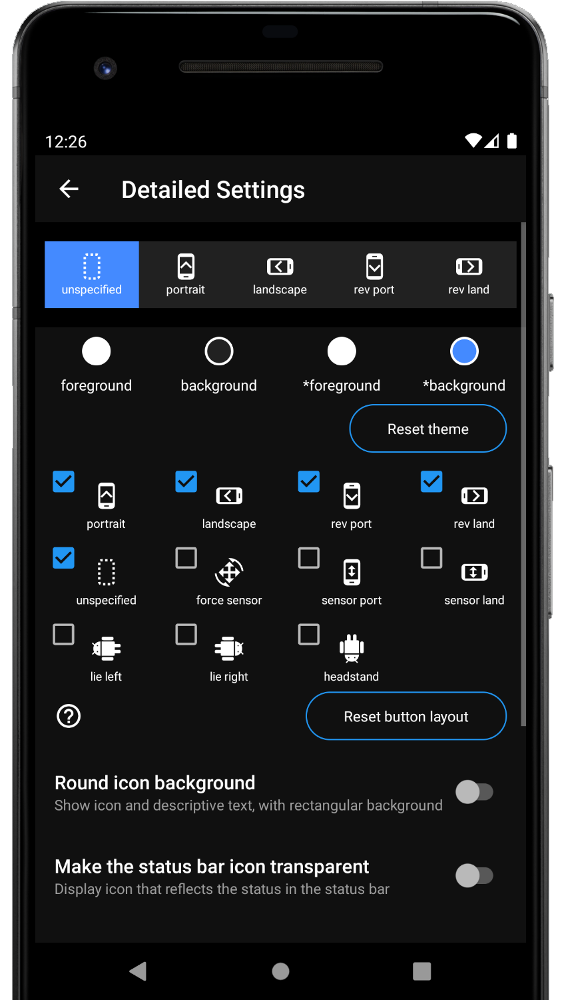
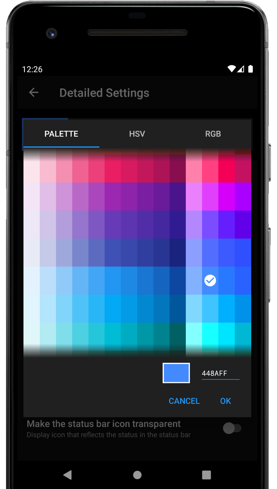

# OrientationFaker

This is an application that fixes the screen in a specific orientation or rotates according to the sensor, regardless of the attributes of the displayed application.
You can change the screen orientation from the notification area. It is also possible to associate a specific application with the screen orientation and switch settings when the application starts.
Not all settings are available because some screen orientations are not supported by some devices.

Because this app forcibly changes the display of the running application, it can become inoperable or, in the worst case, cause a crash.
Please use at your own risk.

## Screenshots

|||||
|-|-|-|-|
|||||

## Install

[Google Play](https://play.google.com/store/apps/details?id=net.mm2d.android.orientationfaker)

## Feature

The following settings are possible

- unspecified
  - Unspecified orientation from this app. Device will be the original orientation of the displayed app
- force sensor
  - Rotate based on sensor information
- portrait
  - Fixed to portrait
- landscape
  - Fixed to landscape
- rev port
  - Fixed to reverse portrait
- rev land
  - Fixed to reverse landscape
- sensor port
  - Fixed to portrait, automatically flip upside down by sensor
- sensor land
  - Fixed to landscape, automatically flip upside down by sensor
- lie left
  - Rotate it 90 degrees to the left with respect to the sensor. If you lie on left lateral and use it, the top and bottom will match.
- lie right
  - Rotate it 90 degrees to the right with respect to the sensor. If you lie on right lateral and use it, the top and bottom will match.

### Trouble shooting

If you can not fix in the opposite direction of the portrait / landscape, try changing the system setting to auto-rotate

## Author

大前 良介 (OHMAE Ryosuke)
http://www.mm2d.net/

## License

[MIT License](./LICENSE)
